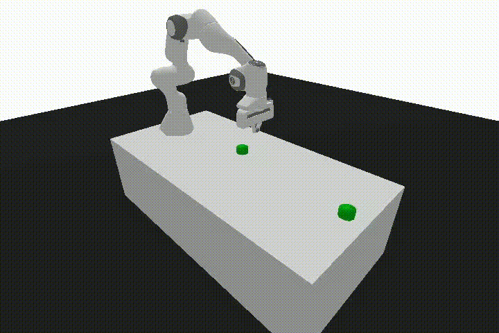

# Panda Manipulation RL

<table align="center">
  <tr>
    <td align="center">
      
      <br>
      <sub><b>PandaReach-v3</b></sub>
    </td>
    <td align="center">
      
      <br>
      <sub><b>PandaPush-v3</b></sub>
    </td>
  </tr>
  <tr>
    <td align="center">
      
      <br>
      <sub><b>PandaSlide-v3</b></sub>
    </td>
    <td align="center">
      
      <br>
      <sub><b>PandaPickAndPlace-v3</b></sub>
    </td>
  </tr>
</table>

## Overview

This project implements a generalized reinforcement learning framework deployed to control a Franka robot arm via end-effector manipulation using various RL algorithms. The framework supports **TD3** (Twin Delayed Deep Deterministic Policy Gradient), **SAC** (Soft Actor-Critic), **TQC** (Truncated Quantile Critics), and **DDPG** (Deep Deterministic Policy Gradient). In addition to the framework, `wandb` integration is enabled for logging metrics, including Q-values, gradients, losses, rolling average reward and success rate, and td error.

While all agents are supported, **DDPG** is the primary focus for training and deployment. This decision is based on [ablation studies](https://arxiv.org/pdf/2106.13687) showing that **SAC** and **TD3** require the removal of clipped Q-values to match **DDPG**'s performance on manipulation tasks (see page 8). Nevertheless, the framework is flexible—agent types can be easily customized for training in other environments where **SAC** or **TD3** may be more effective.

Weights for DDPG are available under `resources/DDPG` for testing/evaluation.

## Installation

1.  Clone the repository:
    ```bash
    git clone https://github.com/CodeKnight314/panda-manipulation-RL.git
    ```
2.  Install necessary python packagaes via `pip`:

    ```bash
    cd panda-manipulation-RL/
    pip install -r requirements.txt
    ```

## Training

To train an agent, run the `main.py` script with `train` mode. You need to specify the agent type, environment ID, configuration file, and an output directory.

For example, to train a DDPG agent on the `PandaReach-v3` task:

```bash
python src/main.py \
    --mode train \
    --agent DDPG \
    --id reach \
    --c src/config/DDPG/config_ddpg_reach.yaml \
    --o resources/DDPG/reach
```

- `--agent`: Specify the agent (`DDPG`, `SAC`, `TD3`, `TQC`).
- `--id`: Specify the task (`reach`, `push`, `slide`, `pickplace`).
- `--c`: Path to the agent and task-specific configuration file.
- `--o`: Path to the directory where trained models and logs will be saved.

## Evaluation

To evaluate a trained agent, run the `main.py` script with `test` mode. You need to provide the path to the trained model weights.

For example, to evaluate the DDPG agent trained on `PandaReach-v3`:

```bash
python src/main.py \
    --mode test \
    --agent DDPG \
    --id reach \
    --c src/config/DDPG/config_ddpg_reach.yaml \
    --o resources/DDPG/reach \
    --w resources/DDPG/reach \
    --neps 20 \
    --verbose
```

- `--w`: Path to the directory containing the trained `actor.pth` and `critic.pth` files.
- `--neps`: Number of episodes to run for evaluation.
- `--verbose`: Use this flag to render the environment and see the agent in action.

## Hyperparameter Search

The project uses Optuna for hyperparameter optimization. To start a search, run the `param_search.py` script.

For example, to search for optimal hyperparameters for a DDPG agent on the `PandaReach-v3` task:

```bash
python src/param_search.py \
    --agent DDPG \
    --env reach \
    --trials 100 \
    --study-name "ddpg_reach_search" \
    --storage "sqlite:///param_search/DDPG_reach/optuna_study.db"
```

- `--agent`: The agent to optimize.
- `--env`: The environment for the task.
- `--trials`: The number of trials to run.
- `--study-name`: A name for the Optuna study.
- `--storage`: The database URL for storing study results.

## A Note on Transferability

This framework is designed to be transferable to custom environments that utilize a dictionary-based observation space. For seamless integration, your environment's `step()` function must return an observation dictionary containing the following keys:

- `observation`: The primary observation from the environment.
- `achieved_goal`: The goal the agent has currently achieved.
- `desired_goal`: The target goal for the agent.

If your environment adheres to this structure, you can easily adapt it for use with this framework. To use a new environment, you can either:

1.  **Modify the `HER_MAPPING` dictionary** in `src/main.py` to include your custom environment's ID.
2.  **Remove the mapping logic** from `src/main.py` and pass your environment's string ID directly to the `--id` argument.

This flexibility allows the agent and training pipeline to be applied to a wide range of goal-oriented robotics tasks with minimal code changes.
